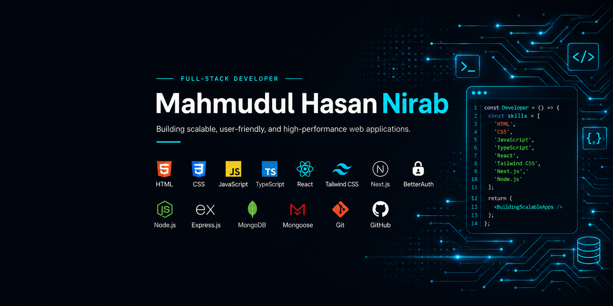

  

# 🚀 Hi, I'm [mahmudul-Hasan-2](https://github.com/mahmudul-Hasan-2)
### ⚙️ MERN Stack Developer | Next.js & TypeScript Expert

  

---

### 💫 About Me

* 💻 **Currently working on:** Advanced Full-Stack applications using **React**, **Next.js**, and **TypeScript**.
* ⚙️ **Using for Backend:** Robust server-side logic with **Node.js**, **Express**, **MongoDB**, and **Mongoose**.
* 🌱 **Currently learning:** Pushing boundaries with **PostgreSQL**, **Docker**, and **Nginx**.
* 💬 **Ask me about:** MERN Stack, Type-Safety, BetterAuth, and Figma to Code conversion.
* ⚡ **Fun Fact:** I believe clean code is just poetry that runs without compilation errors.

---

### 🌐 Connect with Me

  &nbsp;
  

---

### 🛠️ Tech Stack & Tools

#### 🌐 Frontend & UI/UX

  
   
  
  
  

#### 🗄️ Backend, Databases & Auth

  
   
  
  

---

### 📊 GitHub Statistics

  
  

---

### 💬 Dev Quote

> [!TIP]
> **Dev Quote of the Day**  
> *"The best error message is the one that never shows up. Code confidently, type-safe always."* 💻

---

  🤝 <strong>Let's connect and build something impactful!</strong>

