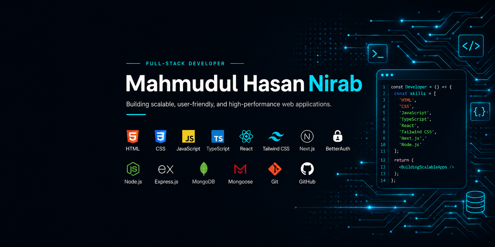

<!-- ===================================================== -->
<!--               HERO SECTION (TOP OF README)             -->
<!-- ===================================================== -->

  

# Mahmudul Hasan

### Frontend Developer • React • Next.js • TypeScript

Building beautiful, responsive and scalable web applications with the MERN ecosystem.

 

---

## About Me

I'm a passionate **Frontend Developer** from **Bangladesh 🇧🇩** who enjoys creating polished user experiences with modern web technologies.

- Modern UI with **React & Next.js**
- Responsive layouts with **Tailwind CSS**
- Full Stack development with **Node.js + Express + MongoDB**
- Authentication with **JWT & BetterAuth**
- Clean reusable component architecture

### Currently

- Learning advanced Next.js & TypeScript.
- Building production-style MERN applications.
- Looking for remote frontend opportunities.

---

## Tech Stack

### Frontend

  

### Backend

  

### Tools & Platforms

  

---

---

# 🚀 Featured Projects

<table>

<tr>

<td width="50%" valign="top">

### 🌟 IdeaVault

A production-ready **MERN Idea Management Platform** where users can securely create, organize and manage ideas.

**✨ Highlights**

- JWT Authentication
- CRUD Operations
- Search & Category Filter
- Responsive UI
- MongoDB Database

**🛠 Tech Stack**

`Next.js` `TypeScript` `Express.js` `MongoDB` `JWT`

**🔗 Links**

[🌐 Live Demo](https://ideavault-client-psi.vercel.app/)

[💻 Client Repository](https://github.com/mahmudul-Hasan-2/ideaVault-client)

[⚙️ Server Repository](https://github.com/mahmudul-Hasan-2/IdeaVault-Server)

</td>

<td width="50%" valign="top">

### 💼 Developer Portfolio

A modern **developer portfolio** built with **React, TypeScript, and TanStack Router**, featuring a clean white-theme UI, smooth animations, and responsive design.

**✨ Highlights**

- Apple-inspired White UI
- Responsive Design
- Smooth Page Transitions
- Fast Performance
- Modern Component Architecture

**🛠 Tech Stack**

`React` `TypeScript` `TanStack Router` `Tailwind CSS` `Vite`

**🔗 Links**

[🌐 Live Website](https://nirab-dev.vercel.app/)

[💻 Source Code](https://github.com/mahmudul-Hasan-2/nirab-dev)

</td>

</tr>

<tr>

<td width="50%" valign="top">

### 🍲 RecipeHub

A full-stack recipe discovery application where users can browse, search and manage recipes with authentication support.

**✨ Highlights**

- Recipe Search
- Categories
- Favorites
- Authentication
- Fully Responsive

**🛠 Tech Stack**

`React` `Express.js` `MongoDB` `Tailwind CSS`

**🔗 Links**

[🌐 Live Demo](https://recipehub-client.vercel.app/)

[💻 Client Repository](https://github.com/mahmudul-Hasan-2/ideaVault-client)

[⚙️ Server Repository](https://github.com/mahmudul-Hasan-2/RecipeHub-Server)

</td>

</tr>

</table>

---

## GitHub Statistics

---

## Most Used Languages

  

---

## Contribution Graph

---

## GitHub Trophies

---

## Currently Building

- Modern MERN Stack Projects
- Dashboard Interfaces
- Authentication Systems
- REST APIs
- TypeScript Applications
- UI Component Library

---

## Learning Journey

## 🚀 Tech Stack Mastery

<table>
<tr>
<td width="240">🌐 HTML5</td>
<td><code>██████████ 100%</code></td>
</tr>

<tr>
<td>🎨 CSS3</td>
<td><code>██████████ 100%</code></td>
</tr>

<tr>
<td>💨 Tailwind CSS</td>
<td><code>██████████ 100%</code></td>
</tr>

<tr>
<td>🟨 JavaScript (ES6+)</td>
<td><code>██████████ 100%</code></td>
</tr>

<tr>
<td>⚛️ React</td>
<td><code>██████████ 100%</code></td>
</tr>

<tr>
<td>▲ Next.js</td>
<td><code>██████████ 100%</code></td>
</tr>

<tr>
<td>🔷 TypeScript</td>
<td><code>██████████ 100%</code></td>
</tr>

<tr>
<td>🟢 Node.js</td>
<td><code>██████████ 100%</code></td>
</tr>

<tr>
<td>🚀 Express.js</td>
<td><code>██████████ 100%</code></td>
</tr>

<tr>
<td>🍃 MongoDB</td>
<td><code>██████████ 100%</code></td>
</tr>

<tr>
<td>🔥 Firebase</td>
<td><code>██████████ 100%</code></td>
</tr>

<tr>
<td>🔐 JWT Authentication</td>
<td><code>██████████ 100%</code></td>
</tr>

<tr>
<td>🌍 REST API</td>
<td><code>██████████ 100%</code></td>
</tr>

<tr>
<td>🐙 Git & GitHub</td>
<td><code>██████████ 100%</code></td>
</tr>

</table>

---

## Let's Connect

---

### Thanks for visiting my profile.

*"Build beautiful things. Keep learning. Ship consistently."*

